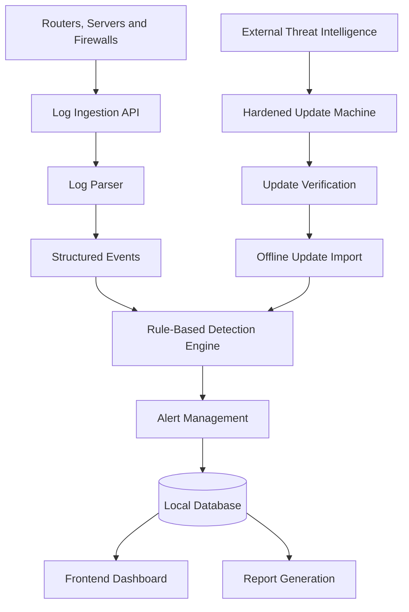

# Airgap Sentinel — Technical Architecture

## 1. Project Overview

Airgap Sentinel is a lightweight cybersecurity platform designed
to monitor security events in isolated network environments.

It collects logs, parses events, detects suspicious behaviour,
generates alerts, and provides security information through an API
and dashboard.

The project also includes an offline update workflow for importing
threat intelligence into the protected environment.

## 2. Technology Stack

- Language: Python
- Backend framework: FastAPI
- Database: SQLite in the current local prototype
- Frontend: HTML, CSS, and JavaScript
- Testing: pytest
- Log processing: Custom log parser
- Detection: Configurable rule-based detection engine

Note: Confirm the database configuration before deployment.
The project may use a different database in another environment.

## 3. System Components

### 3.1 Log Ingestion

Receives security log events through the supported API endpoints.

### 3.2 Log Parser

Extracts relevant fields from log messages, including authentication
events and source IP addresses.

### 3.3 Detection Engine

Evaluates events against configured rules to identify suspicious
activities, including repeated failed logins, abnormal login times,
and indicators matched against imported threat intelligence.

### 3.4 Alert Management

Records detection results, assigns severity, and tracks alert status.

### 3.5 Threat Intelligence Updates

Supports importing update packages into the offline environment.
Update verification should be completed before imported information
is trusted.

### 3.6 API and Dashboard

The FastAPI backend exposes application functionality. The frontend
provides a user interface for viewing information and interacting
with supported features.

### 3.7 Reporting

Generates reports containing available security-event and alert
information.

## 4. Architecture Diagram



This diagram describes the intended system workflow. Actual
connectivity and component behaviour must be verified against
the implementation and deployment configuration.

## 5. Detection Rules

The current test suite covers the following behaviours:

- Repeated failed login detection.
- Suspicious login times.
- Threat intelligence matching.
- Alert generation and explanation.
- Avoiding alerts for normal login activity.

See the detection-engine configuration and automated tests
for the exact thresholds and conditions.

## 6. Offline Security Model

The protected network should not require direct internet access
for local log analysis and threat detection.

Threat intelligence updates should be transferred through a
controlled process. Update packages must be verified before
their contents are trusted.

A USB transfer alone does not guarantee network isolation or
update authenticity. Deployment controls should be documented
and validated separately.

## 7. Testing

Run the automated test suite from the repository root:

```bash
./venv/bin/python -m pytest -v
```

The current test suite covers API operations, log parsing,
detection rules, alerts, threat intelligence, and reporting.

## 8. Limitations and Future Scope

- Expand detection coverage for additional attack patterns.
- Improve dashboard reporting and visualizations.
- Strengthen update authenticity and integrity verification.
- Add deployment-specific access controls and audit logging.
- Validate isolation and one-way data flow in the target environment.
- Evaluate performance using representative synthetic log data.

## 9. Security Considerations

Use synthetic logs for development and demonstrations.
Never commit passwords, API keys, private certificates,
or sensitive operational logs to the repository.

Validate imported update packages before use and restrict
automated response actions to explicitly approved operations.
## 10. Sample Log Data

The repository includes synthetic authentication events in
`sample_data/sample_auth.log`.

The sample contains:
- One successful login.
- Five failed login attempts within 12 seconds.
- Repeated attempts targeting the admin account.
- A consistent source IP address across the failed attempts.

### Expected Detection

The five failed attempts should trigger Rule 001 when evaluated
by the detection engine configured with the tested threshold
of five failures within five minutes.

The resulting alert should be checked against the actual
detection-engine output.

These logs are fictional and intended for testing and demonstration.